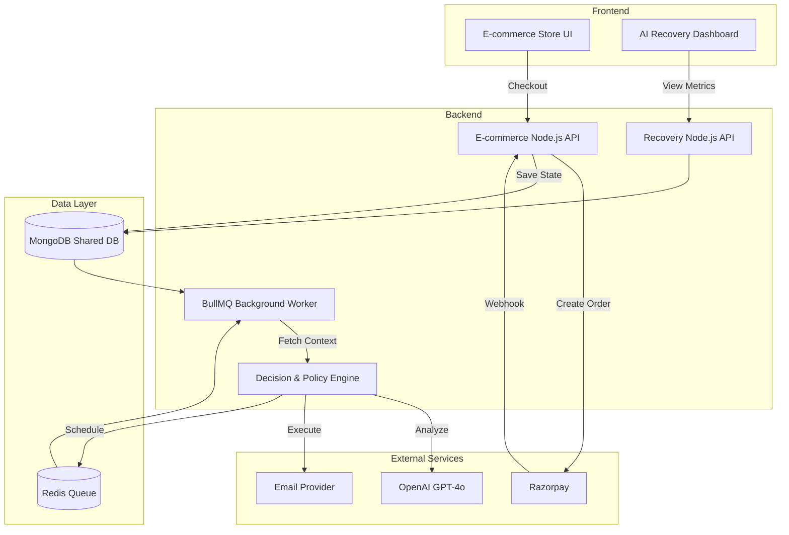
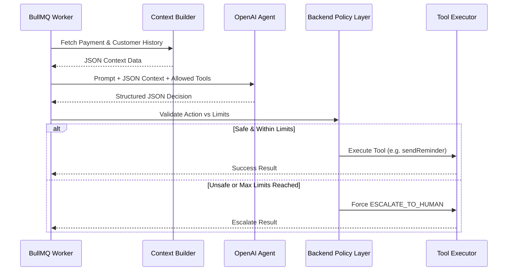
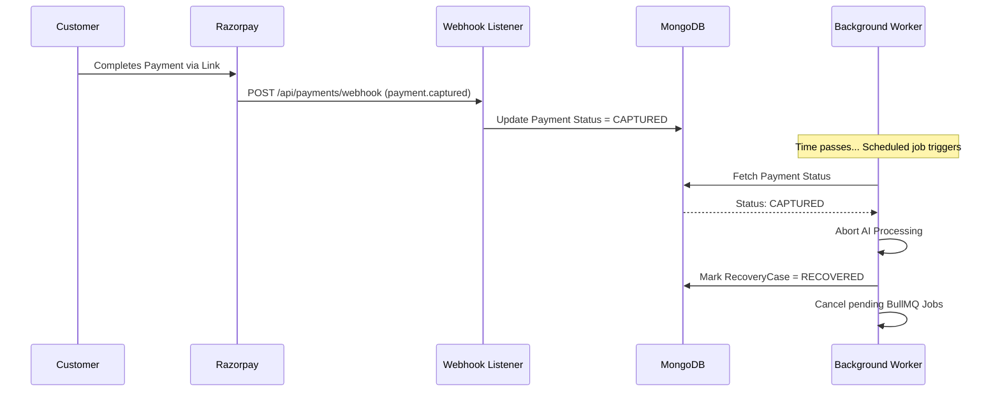

# System Architecture

## A. High-Level Architecture



## B. AI Decision Flow



## C. Recovery Automation Flow

```mermaid
flowchart LR
    Start([Payment Fails]) --> Schedule[Add Job to Redis]
    Schedule --> Wait[Wait 10s (Demo) / 24h (Prod)]
    Wait --> Pop[Worker Pops Job]
    Pop --> CheckDB{Already Paid?}
    CheckDB -->|Yes| Halt([Halt Recovery])
    CheckDB -->|No| AI[AI Decision & Execution]
    AI --> UpdateDB[Update Recovery Case]
    UpdateDB --> CheckLimits{Max Limits?}
    CheckLimits -->|Yes| Escalate([Escalate / Stop])
    CheckLimits -->|No| Schedule
```

## D. Payment Success Flow (Idempotency)


